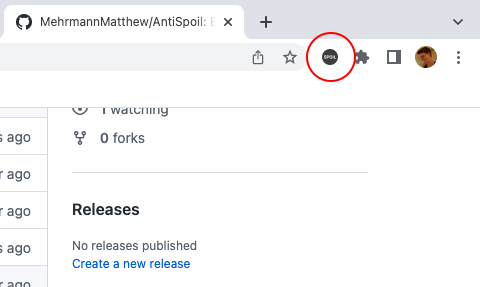

# AntiSpoil
EECS 448 Project Repo for AntiSpoil Extension
***
## Overview
<a name="about">About</a>
<a name="installation">Installation</a>
<a name="use">Use</a>

### About
- Version 1.0 (In Development)

### Installation
1. Download the zip of this project code
2. Extract the zip 
3. Navigate to `chrome://extensions`
4. Enable developer mode
5. Click load unpacked
6. Select the extracted root folder of this project

### Use
(add images below once UI is finalized)
- Open AntiSpoil in your Chrome Extensions

    

- You can toggle AntiSpoil on by clicking the "Toggle" button
    - The extension icon will be dark when disabled

        

    - ...and will show red when enabled.
    
        
- To block spoilers for a keyword or topic, click "Add Phrase" and type your keyword
    - AntiSpoil will automatically find related keywords and phrases to block.
    - Related phrases can be removed by clicking the down-arrow and removing them
- You can remove a full keyword or phrase by clicking the `x` next to it.